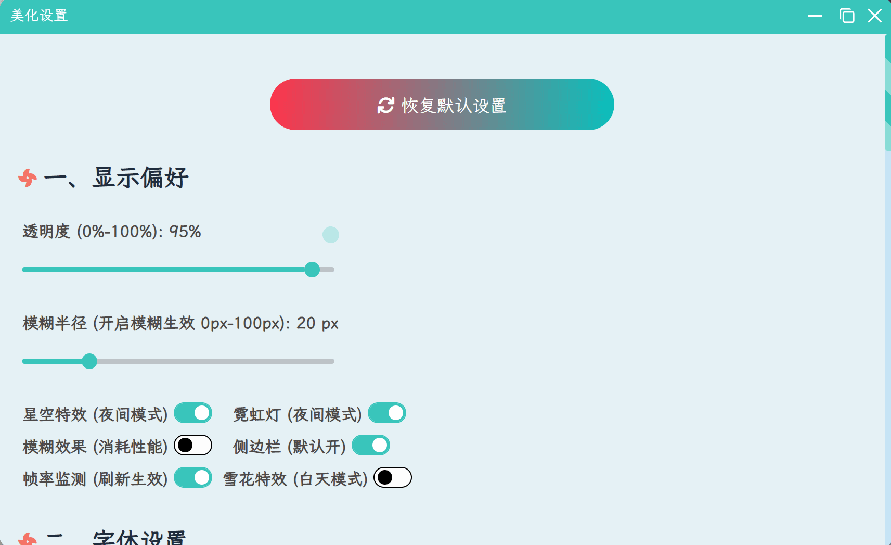

### 🥝的网站目前已经开源啦！！！暂定名为**hexo-theme-Fomalhaut**，原作者网站：[www.fomal.cc](https://www.fomal.cc)，如果你喜欢的话可以帮我点一个免费的Star🌟🌟🌟哦！

### 🚧🚧🚧本开源项目并不适合纯小白，需要一定的魔改经验，因此安装之前务必对Hexo框架命令和Butterfly主题比较熟悉，不熟悉的朋友建议提前熟悉[Hexo中文文档](https://hexo.bootcss.com/docs/configuration.html)和[Butterfly主题文档](https://butterfly.js.org/)，以及熟悉本站魔改教程，别上来就问文章怎么写！！！避免各种不必要的麻烦！！！望周知！！！！！！！！！！


本源码是基于`Butterfly 4.3.1`的二次开发，暂时没做完全的主题分离，因此安装方法是整个博客的替换，建议另起一个文件夹进行安装，或备份好原来的资料再搬过来。当然你也可以不直接搬走，而是借鉴里面的部分代码写法。

### 📅📅📅3.5更新：微调部分样式，修复部分人反映手机端无法加载css样式的问题，问题在`fomal.js`的1340行附近，切换至手机端时候导致空指针异常，这部分代码注释掉即可！

```js
/* 搜索框修复 start */
// searchSize();
// window.addEventListener('resize', searchSize)
// // 搜索窗口自适应
// function searchSize() {
//   // 只需要适应手机端
//   if (document.body.clientWidth > 768) return
//   let div = document.querySelector('#algolia-hits')
//   // 监听插入，如果有插入则根据可视高度动态设置最大高度
//   div.addEventListener('DOMNodeInserted', () => {
//     div.children[0].style.maxHeight = (document.documentElement.clientHeight - 210) + 'px'
//   })
// }
/* 搜索框修复 end */
```

大家如果还遇到什么问题欢迎给作者留言，作者看到会第一时间修复哦，感谢您的支持！

### 🍡🍡🍡安装教程（演示NodeJS v16.14.0 + Hexo 6.3.0）：

1. 安装 NodeJs、Hexo、Git、注册并连接Github，此部分可参考[Hexo博客搭建基础教程(一)](https://www.fomal.cc/posts/e593433d.html)。
  PS：相当于链接教程的第1-7步，第8步就不要做了，不然会清空源码的！！！（不是新手请跳过这条）

2. 把源码打包下载到自己的电脑，然后解压缩到一个你喜欢的文件夹中

3. 在git bash命令中切换到下载的博客根目录，使用以下命令进行模块安装。这里绝不能使用`hexo init`初始化，若不慎用了，则站点的配置文件`_config.yml`内容会被重置

  ```bash
  npm i
  ```

4. 执行以下命令清空并启动项目，启动成功后再浏览器地址栏输入`localhost:4000`进行验证

  ```bash
  hexo cl; hexo g; hexo s
  ```

5. 到这里一般是没啥问题的了，当本地能成功启动后，改一下站点配置文件的`_config.yml`的`deploy`配置项，然后用以下命令部署到Github（这一步出问题的，请删除站点配置文件的`deploy`配置项与`baidu_url_submitter`的信息）

  ```bash
  hexo d
  ```

### 🌈🌈🌈简要说明文档：

- js的主体在`source/js/fomal.js`里面，做了基本分块逻辑的标注，后期整合的，以`... start`和`... end` 包裹

- css主体在`themes\butterfly\source\css\_custom\custom.css`里，与Butterfly的自带样式联合编译为一个index.css，有基本的注释

- 因为兼顾了白天夜间模式不同壁纸和用户自定义壁纸，背景的切换做在了`fomal.js`的第3190行附近，美化模块代码逻辑在`fomal.js`的第2894-3596行，四个背景分别为PC端白天、PC端黑夜、手机端白天、手机端黑夜；美化模块起点为第3356行，可以自定义任何DOM，例如按钮、滑块、开关按钮、图片框和外挂标签等（注意：外挂标签必须要被`<div id="article-container">`包含才会被渲染）

  

  ```js
  /* 美化模块 start */
  ...
  // 雪花开关(这里就是默认关雪花，如果你想默认开就将none改为block)
  if (localStorage.getItem("snow") == undefined) {
    localStorage.setItem("snow", "none");
  }
  ...
  // 背景图(约3190行) 下面链接换成你自己的图片链接
  document.getElementById("defineBg").innerText = `:root{
    --default-bg: url(https://lskypro.acozycotage.net/Fomalhaut/img/dm14.webp);
    --darkmode-bg:url(https://lskypro.acozycotage.net/Fomalhaut/img/yuanshen1.webp);
    --mobileday-bg: url(https://lskypro.acozycotage.net/Fomalhaut/img/snow.webp);
    --mobilenight-bg: url(https://lskypro.acozycotage.net/Fomalhaut/img/mb8.webp);
  }`;
  ...
  // 美化模块主体DOM(约3356行)
    winbox.body.innerHTML = `
    
      ...
      <h3>1. 二次元</h3>
      
      <div class="bgbox">
      <a href="javascript:;" rel="noopener external nofollow" style="background-image:url(https://lskypro.acozycotage.net/Fomalhaut/img/home_bg.webp)" class="imgbox" onclick="changeBg('url(https://lskypro.acozycotage.net/Fomalhaut/img/home_bg.webp)')"></a>
      // 这里自己加图片
      </div>
      
      ...
  
    `
  ...
  /* 美化模块 end */
  
  ```

- 页脚部分请见`themes\butterfly\layout\includes\footer.pug`，包括页脚计时器、徽标、文字、布局等

- 封面图在主题配置文件`_config.butterfly.yml`的`default_cover`配置项，建议配置多项后随机刷出封面图

  ```yaml
  cover:
    # display the cover or not (是否顯示文章封面)
    index_enable: true
    aside_enable: true
    archives_enable: true
    # the position of cover in home page (封面顯示的位置)
    # left/right/both
    position: both
    # When cover is not set, the default cover is displayed (當沒有設置cover時，默認的封面顯示)
    default_cover:
      - https://source.fomal.cc/img/default_cover_14.webp
      - https://source.fomal.cc/img/default_cover_15.webp
      # ......
  ```

  

- 网站图标为根目录的`favicon.ico`，替换为你自己的图标即可

- 欢迎信息地理位置显示，这个需要配置自己的key，类似的还有bibi的配置、朋友圈等配置均需要参考相关文档改成自己的API

- 个人信息卡片的图标和菜单栏等图标，参考[博客魔改教程总结(二)](https://www.fomal.cc/posts/5389e93f.html)中的第4-7项

- 其余配置项基本与Butterfly兼容，参考[Butterfly官方文档](https://butterfly.js.org/)即可

- 遇到问题请多看相关文档(Hexo主题文档、Butterfly主题文档、店长的教程)和本站教程，若有其他疑问请加Q群：`691942826` 验证回答：`🥝开源项目`

