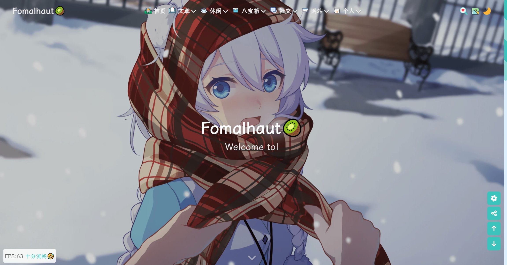

🥝的博客源码，目前已经开源啦！！！暂定名为**hexo-theme-Fomalhaut**，原作者网站:www.fomal.cc


食用方法🍡🍡🍡：

1. 安装 NodeJs、Hexo、Git、注册并连接Github，此部分可参考[Hexo博客搭建基础教程(一)](https://www.fomal.cc/posts/e593433d.html)。
  PS：相当于链接教程的第1-7步，第8步就不要做了，不然会清空源码的！！！

2. 把源码打包下载到自己的电脑，然后解压缩到一个你喜欢的文件夹中

3. 在git bash命令中切换到下载的博客根目录，使用以下命令进行模块安装。这里绝不能使用`hexo init`初始化，若不慎用了，则站点的配置文件`_config.yml`内容会被重置

  ```bash
  npm i
  ```

4. 执行以下命令清空并启动项目，启动成功后再浏览器地址栏输入`localhost:4000`进行验证

  ```bash
  hexo cl; hexo g; hexo s
  ```

5. 到这里一般是没啥问题的了，当本地能成功启动后，改一下站点配置文件的`_config.yml`的`deploy`配置项，然后用以下命令部署到Github

  ```bash
  hexo d
  ```
  
 注意：本项目开源了小站的绝大部分样式，但部分模块需自行更改为自己的密钥或信息，不会的请多看相关文档和本站教程，若有问题请加Q群：691942826 验证：Github开源项目
