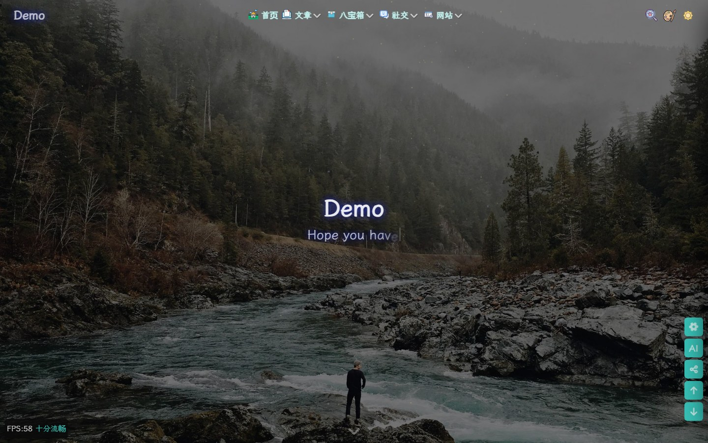
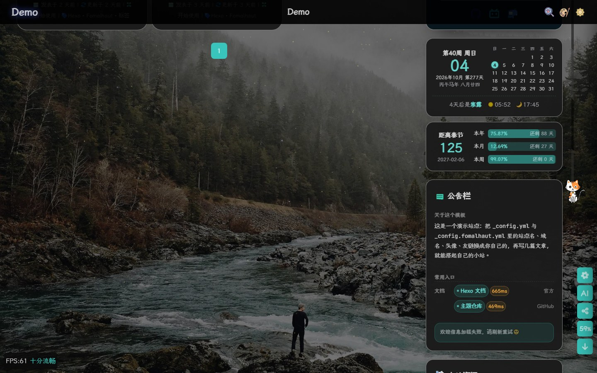
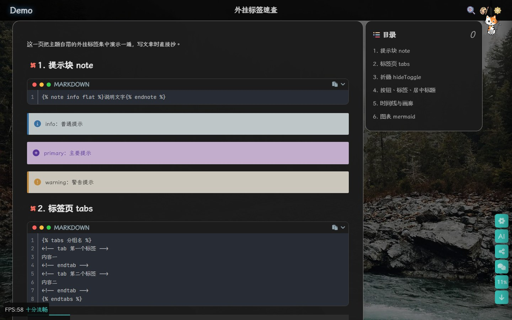
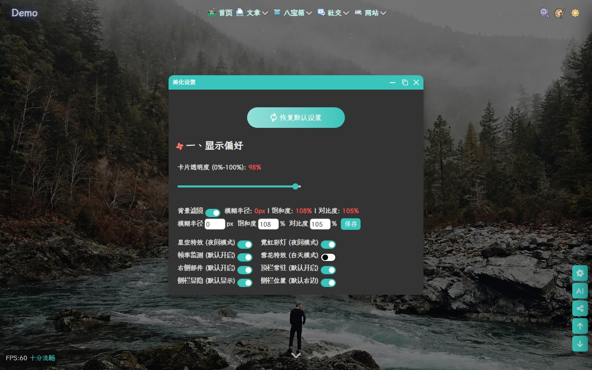

# hexo-theme-fomalhaut · v1.0.3

> 一套「克隆即用」的 Hexo 卡片式博客源码。主题基于 [Butterfly 4.3.1](https://butterfly.js.org/) 深度二次开发，
> 并把**站点配置**与**主题代码**彻底分开：改配置就能搭起自己的站，升级主题不会冲掉你自己的改动。


[界面预览](#六界面预览) · [快速开始](#五快速开始约-10-分钟) · [功能配置](#八主要功能怎么配) · [写文章](#九怎么开始写文章) · [文件地图](#七目录结构与文件地图) · [常见改动](#十最常改的地方速查)

---

## 目录

- [更新日志](#更新日志)
- [一、这是什么](#一这是什么)
- [二、项目架构](#二项目架构)
- [三、相比上一版改了什么](#三相比上一版改了什么)
- [四、环境要求](#四环境要求)
- [五、快速开始（约 10 分钟）](#五快速开始约-10-分钟)
- [六、界面预览](#六界面预览)
- [七、目录结构与文件地图](#七目录结构与文件地图)
- [八、主要功能怎么配](#八主要功能怎么配)
- [九、怎么开始写文章](#九怎么开始写文章)
- [十、最常改的地方（速查）](#十最常改的地方速查)
- [十一、外挂标签速查](#十一外挂标签速查)
- [十二、部署](#十二部署)
- [十三、常见问题](#十三常见问题)
- [十四、授权与致谢](#十四授权与致谢)

---

## 更新日志

### v1.0.3 — 归档页卡片改版与时间轴统计（2026-10-09）

这一版把 `/archives/` 从「日期 + 标题」的列表换成卡片墙（新增 3 个文件，站点级实现、不动主题源码），时间线档案页的统计口径拆细，另修一个 pjax 换页后日历热力图永远转圈的老 bug。

**归档页卡片改版**（新增 `scripts/archive-index.js`、`source/css/archive-page.css`、`source/js/inject/archive-page.js`）

- 版面从下到上：「年度分布」柱状图（每根柱标年份与篇数；年份跨度 ≤ 7 年时逐格画满，超过就只画有文章的年份，避免一整排空柱）→ 「共 N 篇 · 起始年–末年 · 某年最多（N 篇）」汇总 → 年份吸顶跳转胶囊（滚动高亮当前年份，点击平滑滚动并按固定导航高度留偏移）→ 年份章节（大号年份 + 条数 + 「收起 / 展开」按钮，折叠状态记在 `localStorage` 的 `ar-collapsed-years`）→ 卡片栅格；
- 卡片：封面 + 分类胶囊 + 标题 + 日期 + 「约 N 分钟」阅读时长，整卡可点（标题与封面仍是独立链接，可新窗口打开、可被爬虫抓）；封面缺失或加载失败退回「标题首字 + 主题色光晕」占位，懒加载占位图直接读 `data-lazy-src` 补真图，不等 LazyLoad 的扫描时机；
- 零额外请求：构建期由 `scripts/archive-index.js` 注册的 `after_render:html` 过滤器，只往归档页（含 `/archives/page/N/`）的 `</head>` 前插一段 `<script type="application/json" id="ar-index">`，内容是全站每篇的标题 / 路径 / 日期 / 分类 / 字数 / 阅读分钟；阅读时长复用 `hexo-wordcount-fomal` 的口径（中文 300 字/分、英文 160 词/分）；
- 降级与守卫：页面里没有 `ar-index` 时卡片照常渲染、只是不显示分类与阅读时长；容器必须是 `#archive` / `#category` / `#tag` 之一、`.article-sort` 恰好 1 个、且至少有一篇文章，全部通过才给容器加 `.ar-ready`（CSS 选择器全部以 `.ar-ready` 开头），任一环节不成立就整块失效、页面原样；容器上打 `data-ar-archive` 保幂等，首屏 / `pjax:complete` / `pageshow(persisted)` 都能安全重入；
- 同一套样式与脚本对 `/categories/*`、`/tags/*` 也生效；`_config.yml` 新增 `archive_generator` 段（`per_page: 12`、按年 / 按月生成、`order_by: -date`），`_config.fomalhaut.yml` 的 `inject.head` 新增两行引入（`?v=20261013b`），回滚删掉这两行即可。

**时间线档案页统计拆细（`source/js/timeline-archive.js`、`source/css/timeline-archive.css`）**

- 头部统计把原来混在一起的「天数」拆成两个口径：**更新天数**（日期卡数）与**记录条数**（正文条目数，新增 `countEntries()` 数 `.timeline-item-content` 里的 `:scope > ol/ul > li`），并新增**历时**（首尾日期差的天数 + 「约 X 年 Y 个月」，按 30.4375 天/月折算）；
- 年份分隔器文案改成「N 条记录 · M 天」；年份胶囊只写条数，底部多一条占比细条，宽度 = 该年条数 ÷ 全站条数；
- 左栏日期轨从 104px 收到 62px、列间距 28px → 18px（1440px 屏卡片宽约 +52px）；窄屏（≤768px）改单列，日期挪到卡片上方一行小字。

**日历热力图 pjax 修复（`source/js/gitcalendar.js`）**

- 文件级的 `var git_init_seq = 0` 改成挂在 `window.__gitInitSeq` 上：pjax 换页时内联脚本先领号、随后加载的外链脚本会把计数器重置回 0，fetch 回来的数据被判成过期直接丢弃，表现为日历一直停在加载态。

**内容**

- `source/life/music/index.md` 歌单换成网易云「［轻音乐纯享］何人都有孤独之时」（105 首），热评区块同步换新。
### v1.0.2 — 流式渲染与缓存策略（2026-10-05）

这一版集中修三类「用久了才显出来」的问题：AI 助手吐字时掉帧、Service Worker 该失效时不失效、窄屏被撑出横向滚动。回归脚本从 4 个加到 5 个。

**AI 助手流式渲染（`source/js/ai-chat.js`）**

- 分片只累积文本，DOM 提交合并到一帧：`requestAnimationFrame` 提交，配 100ms `setTimeout` 兜底，同一帧里只保留最后一次待提交内容；
- 每帧只重建「尾巴」：新增 `tailCut()`，逐行扫出可定稿的切点（不在代码围栏内、不在有序列表项中间、行内 `**` 与 `[ ]` 成对），已定稿部分一次性 `insertAdjacentHTML` 追加，尾块单独放进 `.ai-tail` 容器（`display: contents`）；
- 滚动改成只写不读：用 passive `scroll` 事件异步维护 `stick` 标记，写位置用 `b.scrollTop = 1e9`（越界会自动夹到最大值，省掉读 `scrollHeight` 触发的强制布局）；手动往上滚不再跟随，滚回底部自动恢复；
- 面板空闲或悬停时预热（`requestIdleCallback` + `pointerenter`），提前建好 DOM 并强制一次样式布局；
- 实测：三条 20 秒突发流从 63.7 / 67.6 fps 提到 89.7 / 89.9 / 90.0 fps，超过 50ms 的卡顿帧 94 / 73 降到 0，强制布局累计 5925 / 7015ms 降到 82 / 106 / 107ms。

**Service Worker 缓存策略（`themes/fomalhaut/source/sw.js`）**

- `CACHE_NAME` 提到 `ICDNCache-v3`，老访客激活时整体丢掉 v2 残片；
- TTL 从一档拆成两档：文本资源（html / js / mjs / css / json / xml / txt / map / webmanifest / manifest / svg）压到 10 分钟，图片、字体、音视频仍按 24 小时。原来全按 24 小时——发版时只改 JS 或 CSS、忘了改 `?v=` 缓存戳的话，URL 与 HTML 都没变，回访者会继续跑旧代码最长一天；
- `getFileType()` 补齐 `cur / avif / bmp / apng / otf / eot / xml / txt / map / webmanifest / manifest / mp3 / m4a / mp4 / webm / pdf / wasm`，原来只列到 `ttf`，`atom.xml`、`search.xml` 与自定义光标都会被当成 `text/plain`；
- 线路探测请求（`?__pr=`）不再写入 CacheStorage，只做「改写 + 回源」。探测每次都用新的随机串，缓存键各不相同，写进去的条目以后永远读不到，而首屏、每次 pjax、每 5 分钟各来一轮，逛得越久堆得越多。

**主题色联动**

- 日历热力图新增 `git_theme_palette()`：直接读 `--theme-color` 实时生成 10 档调色板，换主题色自动重画（`GitCalendarRefresh()` 只在颜色真变了时才清空重绘）；`_config.yml` 里的 `gitcalendar.color` 退化为兜底值。

**指针与滚动**

- 小猫咪光标加两个 `WeakMap` 缓存（控件身份 + 祖先 `cursor:pointer` 链），并给 `MutationObserver` 加过滤：光标自身、`.neko` 的 `data-msg`、`#fps` 的 `title` 等纯输出改动不再触发整轮重算；
- 回形针在窄屏会撑出约 10px 横向溢出，改 `--clip-right: calc(-21px + max(0px, 23px - (100vw - 100%) / 2))`；
- 时间线归档页与年表把 `grid-template-columns` 的固定轨道改成 `minmax(0, 1fr)` 并补 `min-width: 0`，长不可断词不再把页面顶宽。

**细节修正**

- 设置面板的复选框去掉 `translateY(5px)`（套上 flex 居中后会压到文字中线下方）；`.colorRow` 补 `user-select: none` 与 `caret-color: transparent`，点空隙不再落编辑光标；
- 关于页第 5 层「结构化存储」去掉站长的私人数据源，只留评论数据；
- 页脚主题版本号同步，npmmirror 徽章换成源站已去掉阴影的那一版。

**回归脚本**

- 新增 `tools/tests/sw-cache.test.cjs`：纯 VM 跑 Service Worker 源码（caches / fetch / Response 全打桩，不联网、不起服务），断言覆盖域名白名单、回源写缓存、二次请求吃缓存、文本与媒体的 TTL 分流、`?__pr=` 不写缓存；
- `tools/tests/cursor-effects.test.cjs` 配合指针缓存重构扩充。

### v1.0.1 — 打磨与生命周期修复（2026-10-05）

这一版没有新增页面，全部围绕「首屏更快、动画不白跑、滚动不掉帧」：

**首屏关键链**

- 默认正文字体补上游 `preload`（带 `crossorigin`，字体按 CORS 模式取）——浏览器不用再等 `index.css` 解析完才发现字体；
- 夜间默认壁纸与 `source/js/modules/settings.js` 的 `resetBg_()` 对齐到逐字一致的地址，避免同一张图下两份。

**动画与帧率生命周期**

- 雪花 / 星空从「不可见就跳过绘制」升级为「不可见即退出 rAF」，恢复交给 `MutationObserver` / `resize` / `pjax:complete` 的失效回调；
- 帧率监测改成「面板开着才起循环」，采样封装成带 generation 的闭包，切后台自动挂起。

**滚动与指针**

- 修掉主题里 `window.scrollCollect = () => btf.throttle(fn, 200)()` 这种「工厂 + 当场调用」的假节流——原来每次滚动都会新建一个 throttle 再执行，节流形同虚设；
- `btf.throttle` 补 `cancel()`；`pjax.pug` 里手写的两处解绑统一收进清理函数；
- 小猫咪光标改成读写分离：高频指针输入只记最新值，下一帧先读几何再增量写，写入值用 `WeakMap` 缓存（CSSOM 会规范化小数与单位，不能拿序列化后的 style 反复比）；
- 手机端自绘滚动条：滚动 / 布局值在读阶段一次采完，节点创建与样式写入放写阶段。

**样式**

- 评论区重做（`source/css/twikoo.css`）：三张独立白卡浮在压灰一档的面板上，配整块焦点环；
- 侧栏作者卡新增回形针装饰（新增 `source/css/paperclip.css`）：内联 SVG、18° 倾角、针身探出卡片边缘；夜间自动切成冰蓝夜光。

**工程与清理**

- 新增 4 个回归脚本（`tools/tests/`，用 Node 自带的 `node:test`，无额外依赖）：光标效果、帧率生命周期、手机滚动条、滚动监听；
- 新增 `docs/plans/2026-10-05-paperclip.md`，记录回形针的设计参数与回滚方式；
- 删掉 13 个死文件：`leaves.js`、`bibi.js`、`love.js`、`tag-map` 的 proj4 两条、`themes/.../search/local-search.js`、`tw_cn.js`，以及 8 个不再引用的图片资源（`assets/gulp/*`、`loading2.gif`、`r1.webp`、`r2.webp`）；
- 修好控制台字符画的版式与版权行（版权年份改为运行时计算）；
- `error_img` 的兜底图改用主题自带的 `/img/friend_404.gif` 与 `/img/404.jpg`。

### v1.0.0 — 首个正式版（2026-10-04）

主题从 `themes/butterfly` 独立为 `themes/fomalhaut`，站点配置与主题代码彻底分离。详见 [三、相比上一版改了什么](#三相比上一版改了什么)。

---

## 一、这是什么

**hexo-theme-fomalhaut** 是一个跑在 Hexo 上的个人博客主题 / 站点模板。它不是单纯的 `themes/` 目录，而是一整套可运行站点：

- 一套**主题代码**（`themes/fomalhaut/`，Pug + Stylus 渲染）；
- 一份**站点配置**（根目录 `_config.yml` + 根目录 `_config.fomalhaut.yml`）；
- 一批**站点级增强**（根目录 `scripts/` 下的 Hexo 插件、`source/js/` 与 `source/css/` 下的自定义脚本与样式）；
- 若干**示例页面**（网址导航、画廊、八音盒、友人帐、朋友圈、网站统计、时间线归档、天文星图……）与 2 篇示例文章。

它解决的问题是：Hexo 生态里大量的美化方案都靠「直接改主题源码」，一旦主题更新就得重新抄一遍。
本仓库把**主题代码**与**站点改动**放进不同目录，站点侧的东西全部通过「配置注入 + 独立 css/js 文件」实现，升级主题时只需要替换 `themes/fomalhaut/`。

**来源背景**：作者从 2022 年起用 Butterfly 4.3.1 搭建个人博客，三年间持续魔改，把散落在配置与主题里的大量改动逐步抽成独立文件；2026-10 做了一次完整的重构（内部代号「屎山重构」），把 2973 行的单文件 `fomal.js` 拆成模块、把配置里的 26 段内联样式与脚本抽成独立文件，最终整理为 **v1.0.0** 开源。

> ⚠️ **示例数据说明**：仓库里的站点名（Demo）、域名（example.com）、头像、友链、文章、统计 ID 全部是占位示例；
> 图片与字体走公共 CDN（jsDelivr / picsum.photos），不依赖任何私人服务，克隆后开箱即可运行。

---

## 二、项目架构

```
用户请求
   │
   ▼
Hexo 6.3.0  ──┬─► 根 _config.yml           站点级配置（标题 / 作者 / 域名 / 部署 / 插件）
              ├─► 根 _config.fomalhaut.yml  主题配置（Hexo 5+ 的 _config.[theme].yml，本站实际生效）
              ├─► 根 scripts/*.js           站点级 Hexo 插件（构建期过滤器）
              │
              ├─► source/                   站点内容
              │     ├─ _posts/             文章（Markdown）
              │     ├─ box|life|site|social|personal/  独立页面
              │     ├─ css/*.css js/*.js    站点级样式与脚本（不进主题）
              │     └─ _data/{link,widget}.yml          友链与侧栏卡片数据
              │
              └─► themes/fomalhaut/         主题本体
                    ├─ _config.yml         主题默认配置（被根 _config.fomalhaut.yml 覆盖）
                    ├─ layout/*.pug        Pug 模板
                    ├─ source/css/*.styl   Stylus 样式
                    ├─ source/js/*.js      主题脚本
                    └─ scripts/           主题级 Hexo 插件（标签、过滤器、助手函数）
                        │
                        ▼
                 hexo generate  →  public/  →  gulp 压缩  →  推到托管平台
```

**三层配置优先级**（Hexo 5+ 行为）：

| 层级 | 文件 | 作用 |
| --- | --- | --- |
| 站点 | 根 `_config.yml` | 站点名、作者、URL、部署、算法插件等 |
| 主题（生效） | 根 `_config.fomalhaut.yml` | **本站真正使用的主题配置**，所有开关都在这里 |
| 主题（默认） | `themes/fomalhaut/_config.yml` | 主题自带的默认值模板，留作参考 / 兜底 |

---

## 三、相比上一版改了什么

上一版（仓库历史里的 3.22 版）是「整套博客直接开源」：主题仍然是 `themes/butterfly/`，配置叫 `_config.butterfly.yml`，站点页面大多是空壳。
v1.0.0 是一次结构性重写，主要变化：

### 1. 主题独立，改名为 fomalhaut

| 项 | 旧版 (3.22) | 新版 (v1.0.0) |
| --- | --- | --- |
| 主题目录 | `themes/butterfly/` | `themes/fomalhaut/` |
| 主题包名 | `hexo-theme-fomalhaut` v4.3.1（沿用 Butterfly 的 package.json） | `hexo-theme-fomalhaut` v1.0.0（独立版本号） |
| 主题配置 | `_config.butterfly.yml` | `_config.fomalhaut.yml` |
| 配置注入 | 少量 `inject` | 完整 `inject.head` / `inject.bottom` 注入体系 + 独立 css/js 文件 |

### 2. 站点与主题彻底分离

- 所有自定义样式集中到 `themes/fomalhaut/source/css/_custom/custom.css`（近 4000 行，文件头带完整索引地图）与 `source/css/*.css`；
- 所有自定义脚本从单文件 `fomal.js`（2973 行）拆成 **105 行主引导 + 10 个模块**（`source/js/modules/`）与 10 个注入脚本（`source/js/inject/`）；
- 配置里的 26 段内联样式与脚本抽成 `source/css/site-inject.css` 与独立 js，配置文件从 2037 行瘦到 1482 行。

### 3. 新增功能

| 功能 | 位置 | 说明 |
| --- | --- | --- |
| AI 助手 | `source/js/ai-chat.js` + `scripts/ai-chat-inject.js` + `api/chat/completions.js` | 右侧悬浮对话面板，前端可直连也可走同源代理隐藏 Key |
| 美化设置面板 | `source/js/modules/settings.js` | 访客可自选字体、主题色、暗色、阅读模式、背景、特效开关，存 localStorage |
| 侧栏日历 / 倒计时 | `source/js/aside-calendar.js` + `source/js/lunar.js` | 带农历、节气与节日提醒 |
| 手机端抽屉 | `source/css/mobile-drawer.css` | 独立样式表，13 个小节：面板、字标、头像、统计胶囊、菜单、遮罩、入场动效 |
| 网站统计页 | `source/site/census/` + `source/js/census.js` | 图表看板，配色由主题色派生 |
| 时间线归档 | `source/site/time/` + `source/js/timeline-archive.js` | 用时间线标签写站史 / 里程碑 |
| 网址导航 | `source/box/nav/` | 圆形头像小卡式导航，纯 CSS 计数器 |
| 天文星图 | `source/box/astronomy/voyager.html` | 独立完整页面，用 iframe 引入，`skip_render` 不参与渲染 |
| PWA + Service Worker | `themes/fomalhaut/source/sw.js` | 离线预缓存 + 请求分流 |
| 多平台部署 | `vercel.json`、`functions/`、`tools/deploy-vercel.js` | Vercel / Cloudflare Pages 两种方式（要用 GitHub Actions 见「十二、部署」） |

### 4. 工程化与性能优化

- **构建链**：`hexo generate` → `gulp`（html 压缩 / css 压缩），一条命令出产物；
- **图片懒加载修复**：`scripts/swiper-lazyload-fix.js` 处理轮播与 pjax 场景下 lazyload 失效；
- **搜索懒加载**：`source/js/inject/search-lazy.js` 只在用户点开搜索时才拉取；
- **pjax 守卫**：`source/js/pjax-guard.js` 修复换页后状态残留；
- **CDN 预连接**：配置里对首屏外部域名做 `preconnect` / `dns-prefetch`；
- **字体**：11 款自建字体改为公共 CDN（jsDelivr 的 `@fontsource/*`），并精简为 **6 款开源可商用字体**；
- **图片外链**：原本指向作者私人对象存储的封面 / 壁纸 / 站点截图，全部改为公共占位图服务；
- **配置瘦身**：`fomal.js` 2973 → 105 行，`custom.css` 删掉 341 行死代码并补上索引地图。

---

## 四、环境要求

| 依赖 | 版本 | 说明 |
| --- | --- | --- |
| Node.js | **18 / 20 / 22 LTS**（推荐 22） | 仓库自带的 GitHub Actions 工作流使用 `22.x` |
| npm | 9+ | 随 Node 一起安装 |
| Hexo | **6.3.0** | 已写进 `package.json` 的 `hexo.version`，无需全局安装即可用 `npx hexo` |
| Git | 任意较新版本 | 克隆与部署用 |

除此之外不需要 Python、不需要全局 `hexo-cli`。

---

## 五、快速开始（约 10 分钟）

### 1. 克隆并安装依赖

```bash
git clone https://github.com/fomalhaut1998/hexo-theme-fomalhaut.git my-blog
cd my-blog
npm install          # 或 npm ci（有 package-lock.json，更快更稳）
```

> 上面这条命令拉的是**本仓库**。想在它基础上做自己的站，clone 完把远程地址换成你自己的仓库：
> `git remote set-url origin https://github.com/你的用户名/你的仓库名.git`

> 不要在这个目录里执行 `hexo init`！那会重置 `_config.yml`，站点配置会丢。

### 2. 本地预览

```bash
npx hexo server      # 打开 http://localhost:4000
```

改 `source/` 下的内容与 CSS 会自动重新渲染；**改 `themes/` 下的 `.pug` 模板需要重启 server**（Hexo 只在启动时读模板）。

### 3. 改成你自己的站点（关键三步）

**第一步：改 `_config.yml`（站点级）**

```yaml
title: 我的小站
subtitle: ''
description: '记录学习与生活'
keywords: 'Hexo,博客'
author: 你的名字
language: zh-CN
url: https://your-domain.com/

deploy:
  - type: git
    repository: https://github.com/yourname/yourname.github.io.git
    branch: main
```

**第二步：改 `_config.fomalhaut.yml`（主题级）**

至少改这几处，站点就完全是你的了：

```yaml
avatar:
  img: /assets/avatar.webp        # 换成你自己的头像（也可用图床外链）

social:                            # 社交图标，格式： 名称: 链接 || 图标类名 || 动画类名
  Github: https://github.com/yourname || icon-github || faa-tada
  邮箱: mailto:you@example.com || icon-youxiang || faa-tada

index_img: /assets/head.jpg        # 首页大图

footer:
  owner:
    enable: true
    since: 2022

menu:                              # 顶部导航（键 = 显示名，值 = 路径 || 图标）
  首页: / || fas fa-home
  归档: /archives/ || fas fa-archive
  关于: /personal/about/ || fas fa-user
```

**第三步：写文章**

```bash
npx hexo new post "我的第一篇文章"   # 生成 source/_posts/YYYY-MM-DD-我的第一篇文章.md
```

详细写法见 [九、怎么开始写文章](#九怎么开始写文章)。

### 4. 构建产物

```bash
npx hexo clean && npx hexo generate && npx gulp
```

产物在 `public/`，`gulp` 负责 HTML / CSS 压缩。

---

## 六、界面预览

### 首页

顶部是全屏大图 + 站点名 + 打字机副标题，右侧固定悬浮按钮列（设置 / AI 助手 / 分享 / 回到顶部）。



### 首页文章列表与侧栏

文章卡片、侧栏日历（含农历与节气）、倒计时卡、公告栏、小站资讯、右下角交互按钮。



### 文章页

文章标题栏、自动生成的右侧目录、代码块（语言标签 + 一键复制 + 行号）、外挂标签渲染（提示块 / 标签页）。



### 美化设置面板

点右下角齿轮打开。访客可以自己换字体、主题色、背景、特效开关，设置存 `localStorage`，刷新不丢。



> 想换成自己的截图：把图片放进 `repoPic/screenshot/`，改上面这几行的相对路径即可。

---

## 七、目录结构与文件地图

### 7.1 整体结构

```
├─ _config.yml                 站点级配置（标题/作者/域名/部署/插件）
├─ _config.fomalhaut.yml       主题配置 ★ 大部分开关在这里
├─ package.json                依赖与 npm scripts
├─ gulpfile.js                 构建压缩任务
├─ vercel.json                 Vercel 函数配置（用 Vercel 部署时才需要）
├─ scaffolds/                  新建文章/页面的模板
├─ scripts/                    ★ 站点级 Hexo 插件（构建期生效）
├─ api/        Vercel 云函数（AI 代理）
├─ functions/  Cloudflare Pages 函数（同一份逻辑）
├─ tools/      本地脚本（一键部署 Vercel）+ tools/tests/ 回归脚本
├─ .github/dependabot.yml        依赖自动更新（Dependabot）配置
├─ repoPic/                    README 用图（不参与构建）
├─ source/                     ★ 站点内容
│   ├─ _posts/                 文章
│   ├─ _data/link.yml          友链数据
│   ├─ _data/widget.yml        侧栏自定义卡片
│   ├─ assets/                 站点图片（头像、加载动画、徽章…）
│   ├─ css/*.css               站点级样式（见 7.2）
│   ├─ js/*.js                 站点级脚本（见 7.3）
│   ├─ box/  life/  site/  social/  personal/    各种独立页面
│   └─ categories/ tags/       分类页与标签页
└─ themes/fomalhaut/           ★ 主题本体（升级时整体替换即可）
    ├─ _config.yml             主题默认配置（被根 _config.fomalhaut.yml 覆盖）
    ├─ layout/                 Pug 模板
    ├─ source/css|js|img/      Stylus 样式 / 主题脚本 / 主题图
    ├─ scripts/                tag（外挂标签）/ filters / helpers / events
    └─ languages/              多语言文案
```

### 7.2 `source/css/` —— 站点级样式，各管什么

| 文件 | 负责的功能 | 哪里会用到 |
| --- | --- | --- |
| `about-page.css` | 关于页版式（Hero、线路卡、技术栈、时间线） | 选择器全部以 `.ab2` 开头，只影响 `/personal/about/` |
| `aside-calendar.css` | 侧栏「日历卡 + 倒计时卡」外观 | 只作用 `#aside-calendar` / `#aside-countdown`，配 `js/aside-calendar.js` |
| `archive-page.css` | 归档页卡片改版外观（年度分布柱、年份胶囊、年份章节、卡片栅格） | 选择器全部以 `.ar-ready` 开头，只影响 `/archives/`、`/categories/*`、`/tags/*` |
| `avatar-glow.css` | 侧栏头像呼吸灯（颜色跟随主题色） | 全站侧栏生效 |
| `census.css` | 网站统计页看板排版 | 只由 `/site/census/` 页面 `<link>` 引入 |
| `coin.css` | 投币按钮样式 | 文章底部「投喂」区 |
| `gitcalendar.css` | GitHub 贡献日历底色与格子 | `#git_container`，配 `js/gitcalendar.js` |
| `kslink.css` | 友人帐「快速申请」按钮 | `/social/link/` |
| `paperclip.css` | 侧栏作者卡的细长回形针装饰（内联 SVG，白天蓝白高光 / 夜间冰蓝夜光） | 由 `inject.head` 引入，只影响电脑端侧栏作者卡 |
| `mobile-drawer.css` | 手机端抽屉菜单改版（面板/字标/头像/菜单/遮罩/入场动效 13 小节） | 窄屏自动生效 |
| `site-inject.css` | 站点注入样式合集（横幅公告、PC 浅色主题、侧栏加宽、列表分页、面包屑、小站资讯卡、aplayer 音量条、页脚隐藏本站项等） | 由 `_config.fomalhaut.yml` 的 `inject.head` 以 `<link>` 引入 |
| `stats.css` | 文章统计页图表排版 | 只由 `/tags/` 页生效 |
| `timeline-archive.css` | 「旧时光」页时间轴外观 | `/site/time/` |
| `twikoo.css` | Twikoo 评论区美化（表单/列表/按钮统一到主题色） | 全站评论，配 `comments.use: Twikoo` |
| `typewriter.css` | 首页副标题打字机观感 | 配 `js/inject/typewriter.js` |

### 7.3 `source/js/` —— 站点级脚本，各管什么

**入口与模块**（由 `source/js/fomal.js` 统一按顺序加载，加载清单在 `_config.fomalhaut.yml` 的 `inject.bottom`）

| 文件 | 负责的功能 |
| --- | --- |
| `fomal.js` | 站点主引导（105 行）。定义全局 `window.__fomal`，控制台执行 `__fomal.check()` 可自检各模块是否加载成功 |
| `modules/reading.js` | 阅读进度条 + FPS 检测（左下角那个 FPS 数字） |
| `modules/nav.js` | 导航栏吸顶、首屏欢迎语、侧栏「欢迎信息」卡片（腾讯位置服务）、分享按钮、「随便逛逛」 |
| `modules/console-art.js` | 控制台字符画与版权署名 |
| `modules/effects.js` | 页面装饰特效：雪花 / 星空 / 表情放大 |
| `modules/cursor.js` | 鼠标相关：右键菜单、小猫咪、听话鼠标 |
| `modules/shell.js` | 站点「外壳」行为：快捷键、夜间动画、标题恶搞、搜索框、手机滚动条 |
| `modules/settings.js` | **美化设置面板**（Winbox），含字体 / 主题色 / 背景 / 显示偏好四节的全部交互 |
| `modules/footer-time.js` | 页脚「本站已运行 X 天」计时器 + 摸鱼徽章 |
| `data/holidays.js` | 法定休息日判断（纯数据） |
| `data/voyager1.js` | 旅行者 1 号距离模型（纯计算），页脚那行「旅行者 1 号当前距离地球…」 |

**独立功能脚本**（按需由配置引入或在页面里 `<script>`）

| 文件 | 负责的功能 |
| --- | --- |
| `ai-chat.js` | AI 助手前端本体（对话面板、流式输出、Markdown 渲染） |
| `aside-calendar.js` | 侧栏日历卡 + 倒计时卡渲染（含农历、节气、距离下一个节日） |
| `lunar.js` | 农历 / 二十四节气换算（1900–2100） |
| `festival.js` | 节日提醒通知卡片（25 个节日集中成一张表） |
| `celebrate.js` | 全屏礼炮 / 烟花（只在喜庆节日被 `festival.js` 动态插入） |
| `author-status.js` | 侧栏个人信息卡右上角状态胶囊（按时间与节假日切换） |
| `census.js` | 网站统计页图表数据（百度统计 API） |
| `stats.js` | 文章统计页增强 |
| `gitcalendar.js` | GitHub 贡献日历渲染 |
| `timeline-archive.js` | 「旧时光」页时间轴行为层 |
| `notify.js` | 轻量通知组件（替代 Vue + Element-UI 的 `$notify`） |
| `pjax-guard.js` | 修 pjax 选择器不匹配导致的「换页退回整页刷新」与「加载遮罩一直转圈」 |
| `wechat-qr.js` | 社交二维码点击 → 同页灯箱展示（不跳转不下载） |
| `kslink.js` | 友人帐「快速申请」表单填充 |
| `coin.js` | 投币音效与动画 |
| `footer-music.js` | 页脚「猜你想看」补一条「听点音乐」→ `/life/music/` |
| `51la.js` | 51LA 统计与灵雀监控初始化 |
| `jquery.min.js` / `winbox.bundle.min.js` | 第三方库 |

**`source/js/inject/`**（由 `_config.fomalhaut.yml` 的 `inject.head` / `inject.bottom` 以 `<script>` 引入）

| 文件 | 负责的功能 |
| --- | --- |
| `beauty-boot.js` | 美化模块首屏预置（把 localStorage 里的字体/主题色/背景尽早写进 `:root`，避免闪一下默认样式） |
| `typewriter.js` | 首页副标题打字机「丝滑版」（同名 `window.Typed` 接管主题自带 Typed.js） |
| `search-lazy.js` | Algolia 搜索按需加载（点开搜索才拉取） |
| `scroll-gap-fix.js` | 锚点跳转补偿（常驻顶栏 70px） |
| `webinfo-card.js` | 侧栏「小站资讯」卡：KPI 数字滚动、运行天数、站点更新时间 |
| `ping-route.js` + `ping-route-boot.js` | 公告栏里每条部署线路的实时延迟徽标（boot 文件放可调参数 initialDelay / stagger） |
| `about-route-probe.js` | 关于页线路卡右下角的「实时延迟」徽标 |
| `archive-page.js` | 归档页卡片改版行为层：只读 `.article-sort` 重排成统计条 + 年份跳转 + 可折叠年份章节 + 卡片栅格（三层守卫 + 幂等，降级不改排版） |
| `pc-local-link.js` | 版权卡「文章链接」显示当前访问域名（而不是写死主域名） |
| `right-menu-state-boot.js` | 侧栏「右键模式」按钮的状态同步 |
| `ft-ad-extra.js` | 页脚友链补一个「广告位招租」（靠 `a[title="广告位招租"]` 存在才生效） |

### 7.4 `scripts/` —— 站点级 Hexo 插件（构建期跑）

| 文件 | 负责的功能 |
| --- | --- |
| `ai-chat-inject.js` | 往每个页面 `</body>` 前注入 `window.AI_CHAT_CONFIG` 与 `/js/ai-chat.js` |
| `archive-index.js` | 给归档页 `</head>` 前插一段 `ar-index` JSON（全站每篇的标题/路径/日期/分类/字数/阅读分钟），供归档页卡片显示分类与阅读时长 |
| `gallery-pager.js` | 相册自动分页（生成 `/box/gallery/wallpaper/p2.html` 这类分页） |
| `magnet-local-links.js` | 修 `hexo-magnet-fomal` 首页小冰磁贴跳到外站的问题 |
| `post-copyright-local-link.js` | 修文章版权卡「文章链接」写死主域名的问题 |
| `sticky-post.js` | 正文标记置顶（`sticky: true` → 首页置顶角标） |
| `swiper-lazyload-fix.js` | 修首页轮播在 pjax 往返后懒加载失效 |
| `tag-map-local.js` | 把 `hexo-tag-map` 的 jsDelivr CDN 改成本站自托管 |
| `vercel-api-copy.js` | 构建后把 `api/`、`functions/`、`vercel.json` 拷进 `public/` |

### 7.5 `tools/tests/` —— 回归脚本

用 Node 自带的 `node:test`，不需要额外依赖：

| 文件 | 覆盖的行为 |
| --- | --- |
| `cursor-effects.test.cjs` | 小猫咪光标的读写分离与元素缓存 |
| `fps-lifecycle.test.cjs` | 帧率监测的启动 / 停止与 generation 闭包 |
| `mobile-scrollbar.test.cjs` | 手机端自绘滚动条的读 / 写两阶段 |
| `scroll-listeners.test.cjs` | 滚动节流、`cancel()` 与 pjax 解绑 |
| `sw-cache.test.cjs` | Service Worker 的域名白名单、回源写缓存、二次请求吃缓存、文本与媒体 TTL 分流、`?__pr=` 探测不写缓存 |

跑法：`node --test "tools/tests/*.test.cjs"`（共 119 个用例；部分脚本支持用环境变量指向 `bak/` 里的基线做前后对比）。

### 7.6 `themes/fomalhaut/` —— 主题本体

| 目录 | 说明 |
| --- | --- |
| `layout/` | Pug 模板：`index` / `post` / `page` / `archive` / `category` / `tag` + `includes/` 组件（head、header、footer、aside、widget、third-party…） |
| `source/css/` | Stylus 样式；`_custom/custom.css` 是站点自定义总表（文件头有完整索引） |
| `source/js/` | 主题自带脚本（`main.js` 等） |
| `scripts/tag/` | 外挂标签实现 |
| `scripts/filters/` | 构建期过滤器（图片懒加载、随机封面） |
| `scripts/helpers/` | 模板助手（归档、分类、相关文章、echarts…） |
| `scripts/events/` | 启动事件（版本横幅、CDN 预解析、404、评论初始化） |
| `languages/` | 多语言文案 |

> 💡 **要不要改主题？** 尽量别改。能用配置解决的走 `_config.fomalhaut.yml`；配置解决不了的，写进 `source/css/*.css` 或 `source/js/`，再用 `inject` 引入——这样升级主题时直接覆盖 `themes/fomalhaut/` 就行。

---

## 八、主要功能怎么配

> 下面所有片段都写在**站点根目录**的 `_config.fomalhaut.yml` 里（除非特别说明）。

### 8.1 导航菜单

```yaml
menu:
  首页: / || fas fa-home
  时间轴:
    归档: /archives/ || fas fa-archive
    标签: /tags/ || fas fa-tags
  清单:
    友人帐: /social/link/ || fas fa-link
    朋友圈: /social/fcircle/ || faa-tada
  关于: /personal/about/ || fas fa-user
```

缩进一层就是二级菜单。图标可以写 `fas fa-xxx`（Font Awesome）或 `faa-tada`、`faa-spin` 这类动画类名。
菜单项指向的页面如果不存在，直接在 `source/` 里建一个同名目录 + `index.md` 即可（见 [9.3 加新页面](#93-加一个新页面)）。

### 8.2 顶部图与封面

```yaml
disable_top_img: false
index_img: /assets/head.jpg        # 首页顶部大图（留空 = 不显示，露出站点背景图）
default_top_img: /assets/head.jpg  # 其他页面默认顶部图
archive_img:                       # 归档页顶部图（留空跟随 default_top_img）
category_img:                      # 分类页顶部图

cover:
  index_enable: true    # 首页文章卡片显示封面
  aside_enable: true    # 侧栏文章卡片显示封面
  archives_enable: true # 归档页显示封面
  default_cover:        # 文章没写 cover 时从这里随机取一张
    - https://picsum.photos/id/1015/1200/675
    - https://picsum.photos/id/1018/1200/675
```

- 单篇文章想指定封面：在文章 Front-matter 写 `cover: 图片链接`。
- `cover.default_cover` 现在填的是**固定的 picsum 图片 ID**（不是随机 seed），所以每次刷新不会变图、也不会出现奇怪内容。换成你自己的图床地址即可。

### 8.3 主题色与暗色模式

```yaml
theme_color:
  enable: true
  main: '#49b1f5'       # 主题色（留空则用顶部那套默认值）
  paginator:            # 分页器颜色
  button_hover:         # 按钮悬浮色
  text_selection:       # 选中文字底色
  link_color: '#a591e0' # 链接色
  meta_color: '#858585' # 次要文字
  hr_color: '#A4D8FA'   # 分隔线

display_mode: light     # light | dark | auto（跟随系统）
darkmode:
  enable: true
  button: true          # 右下角显示日夜切换按钮
```

站点里绝大部分自定义样式的颜色都由 `var(--theme-color)` 派生（用了 `color-mix`），所以换主题色时整站会跟着变——这也是美化面板「主题色设置」能实时预览的原因。

### 8.4 侧栏卡片

```yaml
aside:
  enable: true
  card_author:            # 个人信息卡
    enable: true
    description: '这是我的小站'
    button:
      enable: true
      text: 关注我
      link: https://github.com/yourname
  card_announcement:      # 公告栏（支持 HTML）
    enable: true
    content: 这里写公告
  card_recent_post:       # 最新文章
    enable: true
    limit: 5
  card_categories:        # 分类
    enable: true
    limit: 8
  card_tags:              # 标签
    enable: true
    limit: 40
  card_archives:          # 归档
    enable: true
    type: monthly
    format: MMMM YYYY
  card_webinfo:           # 小站资讯（字数 / 访客 / 运行天数）
    enable: true
    post_count: true
    last_push_date: true
  card_friend_link:       # 友人帐侧栏卡
    enable: true
  card_newest_comment:    # 最新评论
    enable: false
```

想加**完全自定义**的卡片：写进 `source/_data/widget.yml`，用 `top:` / `bottom:` 分组，`html:` 里写任意 HTML。
侧栏的「日历卡 / 倒计时卡」就是这么做出来的（见 `source/js/aside-calendar.js` 顶部注释）。

### 8.5 评论系统

支持 11 种：`Twikoo` / `Waline` / `Valine` / `Giscus` / `Utterances` / `Gitalk` / `Disqus` / `Disqusjs` / `Livere` / `Remark42` / `Facebook Comments`。

```yaml
comments:
  use:
    - Twikoo               # ★ 在这里切换用哪个
  text: true               # 显示「评论」二字
  lazyload: true           # 滚动到评论区才加载（开了之后评论数会失效）
  count: false             # 文章顶部显示评论数
  card_post_count: false   # 首页卡片显示评论数
```

#### Twikoo 完整配置（推荐，无需后端服务器）

1. **部署 Twikoo 服务端**（三选一）：
   - **Vercel 一键部署**（最省事）：打开 <https://twikoo.js.org/quick-start.html> → 点「Vercel 部署」→ 登录 Vercel → 一路 Next → 部署完把首页那张图里的地址复制下来；
   - **Docker**：`docker run -d -p 8080:8080 -v /data/twikoo:/data -e TWIKOO_THROTTLE=200 ikew0ng/twikoo`；
   - **云函数**：腾讯云 SCF / 阿里云 FC 都有 Twikoo 模板。
2. **在配置里填地址**：

```yaml
twikoo:
  envId: https://你的-twikoo-地址         # ← 就这一处必填
  region:                                # 腾讯云 SCF 部署时才需要填（如 ap-shanghai）
  visitor: false                         # 开启访客统计（需要配合 envId 的服务端）
  option:                                # 透传给 Twikoo 初始化，如 lang、path
```

3. **打开评论区**：把上面的 `comments.use` 设成 `Twikoo`。
4. **（可选）美化**：仓库已带 `source/css/twikoo.css`，由 `_config.fomalhaut.yml` 的 `inject.head` 引入，把表单/列表/按钮统一到主题色。不需要就在 `inject.head` 里删掉那一行。
5. **（可选）首页显示最新评论**：把 `aside.card_newest_comment.enable` 设为 `true`。

> 其他评论系统的参数（`waline` / `valine` / `giscus` …）在同一个配置文件的 `comments` 段下方，键名与官方文档一致，照填即可。

### 8.6 搜索

```yaml
local_search:            # 方案 A：本地搜索，零后端、零 Key
  enable: true
  preload: false
  top_n_per_article: 1
  unescape: false
  trigger: auto          # auto = 点开搜索才拉取（更快）；manual = 手动

algolia_search:          # 方案 B：Algolia 云搜索（内容多时更快、支持全文高亮）
  enable: false
  hits:
    per_page: 10
```

用 Algolia 还要在根 `_config.yml` 补上应用信息（否则构建时报错）：

```yaml
algolia:
  appId: YOUR_ALGOLIA_APP_ID         # https://dashboard.algolia.com/account/api-keys
  apiKey: YOUR_ALGOLIA_SEARCH_KEY
  adminApiKey: YOUR_ALGOLIA_ADMIN_KEY
  chunkSize: 5000
  indexName: your_index_name
  fields:
    - content:strip:truncate,0,30000
    - excerpt:strip
    - permalink
    - title
```

改完执行 `npx hexo algolia` 推送索引，再 `npx hexo generate`。仓库里 `source/js/inject/search-lazy.js` 会让 Algolia 的资源延后到点开搜索才加载。

### 8.7 网站统计

#### ① 不蒜子（前端 PV / UV，零配置）

```yaml
busuanzi:
  site_uv: true     # 站点访客数
  site_pv: true     # 站点访问量
  page_pv: true     # 单页访问量
```

#### ② 各平台统计脚本（填 ID 即生效）

```yaml
baidu_analytics:                     # 百度统计 ID，https://tongji.baidu.com/web/welcome/login
google_analytics:                    # GA4 衡量 ID（G-XXXXXXX）
cnzz_analytics:                      # 友盟 CNZZ 站点 ID
cloudflare_analytics:                # Cloudflare Web Analytics token
microsoft_clarity:                   # Microsoft Clarity ID
```

#### ③ 51LA + 灵雀监控（这个不在 yml 里）

打开 `source/js/51la.js`，把两个 ID 换成你自己的（<https://user.51.la/> 申请）：

```js
LA.init({ id: "YOUR_51LA_ID", ck: "YOUR_51LA_CK", hashMode: true });
new LingQue.Monitor().init({ id: "YOUR_LINGQUE_ID", sendSpaPv: true });
```

不需要就在 `_config.fomalhaut.yml` 的 `inject.head` / `inject.bottom` 里删掉 `sdk.51.la` 与 `/js/51la.js` 那几行。

#### ④ 网站统计页 `/site/census/`（图表看板）

这一页用百度统计的开放 API 拉数据，配置在 `source/js/census.js`：

```js
var start_date = '20200101'                     // 统计开始日期
var access_token = 'YOUR_BAIDU_ACCESS_TOKEN'    // 百度统计 access_token（30 天有效）
var site_id = 'YOUR_BAIDU_SITE_ID'              // 站点 ID
// 刷新 token 的接口见文件第 4 行注释
```

不想用就把 `source/site/census/` 整个目录删掉，并去掉菜单里的「网站统计」。

#### ⑤ GitHub 贡献日历

根 `_config.yml` 里的 `gitcalendar` 段（**默认已关闭**，因为它需要你自己搭数据源）：

```yaml
gitcalendar:
  enable: true                       # 想用就改成 true
  enable_page: /site/census/
  user: yourname                     # GitHub 用户名
  apiurl: "https://gitcalendar.example.com"   # 自建的 gitcalendar 服务
  jsonurl: "https://cdn.jsdelivr.net/gh/yourname/gitcalendar-data@main/data.json" # 或 GitHub Action 定时产出的 JSON
```

### 8.8 美化设置面板（每一项都干什么）

打开方式：右下角**齿轮图标**（`themes/fomalhaut/layout/includes/rightside.pug` 的 `#rightside_config`），面板本体在 `source/js/modules/settings.js`。
所有设置存在浏览器 `localStorage`，不写服务器；面板底部有「恢复默认设置」。

| 分节 | 项目 | 作用 |
| --- | --- | --- |
| **一、显示偏好** | 卡片透明度 | 正文卡片背景的不透明度（0–100%） |
| | 背景滤镜 | 对全站背景图做模糊 / 饱和度 / 对比度处理（各一个滑条 + 保存） |
| | 星空特效（夜间模式） | 夜间背景上飘的星空粒子 |
| | 霓虹彩虹（夜间模式） | 夜间标题的霓虹发光动画 |
| | 帧率监测 | 左下角 FPS 数字（调试用，平时可关） |
| | 雪花特效（白天模式） | 白天飘雪 |
| | 右侧部件 | 右下角按钮列的显示/隐藏 |
| | 顶栏常驻 | 滚动时导航栏是否一直吸顶 |
| | 侧栏显隐 | 侧栏显示 / 隐藏 |
| | 侧栏位置 | 侧栏放左边还是右边 |
| **二、主题色设置** | 13 个预设色 | red / orange / yellow / green / puregreen / blue / heoblue / darkblue / purple / purepurple / pink / gray / black，点一下全站换色 |
| **三、字体设置** | 常规字体 3 款 | 霞鹜文楷（默认）/ 思源宋体 / 霞鹜新晰黑，另有「系统默认」 |
| | 代码块字体 3 款 | JetBrains Mono / Fira Code / Source Code Pro |
| **四、背景设置** | 1 风景 · 山野 / 2 风景 · 水与森林 / 3 风景 · 更多 | 三组风景壁纸（各 8 张，走 picsum 公共 CDN） |
| | 4 渐变色 / 5 纯色 | 免图片的渐变与纯色背景 |
| | 6 适配手机 | 竖屏比例的背景图 |
| | 7 壁纸 API | 每次刷新随机换一张的在线壁纸接口 |
| | 8 自定义背景 | 自己粘贴图片链接 |

**改面板本身**：

- 想改**默认值**（访客没动过面板时用什么）：改 `_config.fomalhaut.yml` 的 `font` / `theme_color` / `background` 段，以及 `source/js/inject/beauty-boot.js`；
- 想改**可选列表**（加字体、加壁纸、加主题色）：改 `source/js/modules/settings.js` 的 `FONT_LIST` / `CODE_FONT_LIST`（第 108–111 行）与面板 HTML（第 845–1050 行），新增字体的 `@font-face` 写在 `themes/fomalhaut/source/css/_custom/custom.css` 的「字体引入」一节；
- 想**直接关掉面板**：`_config.fomalhaut.yml` 的 `beautify.enable: false`，然后去掉 `inject.bottom` 里 `settings.js` 那一行。

### 8.9 刷新与性能相关开关

```yaml
pjax:
  enable: true        # 站内跳转不整页刷新
instantpage: true     # 鼠标悬停在链接上时预加载
lazyload:
  enable: true
  field: site         # site = 全站；post = 仅文章
  blur: true
pangu: true           # 中英文之间自动加空格
preloader:            # 首屏加载动画
  enable: false
  source: 1           # 1~10，对应 themes/fomalhaut/layout/includes/loading/load_style/
```

### 8.10 AI 助手

#### 它是什么

右侧悬浮的对话面板，能总结当前页面、解释名词。前端本体在 `source/js/ai-chat.js`，由 `scripts/ai-chat-inject.js` 自动注入到每个页面（不改主题源码）。

#### 配置项（`_config.fomalhaut.yml` 的 `ai_chat` 段）

```yaml
ai_chat:
  enable: true                 # 总开关：false 则不注入按钮和面板
  api_base: https://api.deepseek.com
  api_key: ''                  # ⚠️ 直接写 Key 会随页面下发，只建议本地测试
  api_key_file: .ai-chat-key   # 或把 Key 写进这个文件（已在 .gitignore 里）
  model: deepseek-chat         # 换模型只改这一行
  temperature: 0.7
  max_tokens: 8192             # 单次回复上限（含思考模型的 reasoning token）
  max_history: 12              # 每次带给模型的历史轮数
  max_page_chars: 32000        # 页面正文上限（超长文章取开头 60% + 结尾 35%）
  timeout_ms: 10000            # 首字节超时提示
  welcome: 你好，我是这个页面的 AI 助手……
  first_question: 请用中文总结这个页面的内容：先用一句话概括，再列 3-5 条要点。
  system_prompt: |
    你是这个博客的页面助手，语气自然、简洁、像朋友聊天。
```

#### 两种用法

**用法 A：直连服务商（本地 / 内网测试用）**

把 Key 放进 `.ai-chat-key`（站点根目录，一行纯文本）或直接写 `ai_chat.api_key`。
这样 Key 会随页面下发到浏览器，**任何人 F12 都能看到**，别在公网用。

**用法 B：同源代理（公网推荐，仓库已带实现）**

1. 部署平台加环境变量 `DEEPSEEK_API_KEY`（Vercel：Settings → Environment Variables；Cloudflare Pages：Settings → Environment variables）；
2. 构建时 `scripts/ai-chat-inject.js` 会自动把前端的 `api_base` 改成 `/api`、Key 换成占位符 `via-proxy`；
3. 请求打到 `api/chat/completions.js`（Vercel）或 `functions/api/chat/completions.js`（Cloudflare Pages），由它在服务端读环境变量再去请求服务商。

代理函数自带：每 IP 限流、`max_tokens` 上限（`MAX_TOKENS_CAP = 8192`）、CORS 白名单。
白名单默认放行 `example.com`，改法：

```bash
# 方式一：直接改两个常量（api/chat/completions.js 与 functions/api/chat/completions.js 都要改）
const DEFAULT_ORIGINS = 'https://example.com,https://www.example.com'
const DEFAULT_SUFFIXES = 'example.com'

# 方式二：不改代码，用环境变量覆盖
AI_PROXY_ORIGINS=https://your-domain.com
AI_PROXY_ALLOW_SUFFIXES=your-domain.com
```

#### 换成别的大模型

`api_base` 改成服务商地址（如 `https://api.openai.com`、`https://api.moonshot.cn`），`model` 改成对应模型名，代理函数里的 `Authorization: Bearer <key>` 是 OpenAI 兼容格式，大多数国内厂商都通用。

#### 关掉它

`ai_chat.enable: false` 即可（面板、按钮、注入脚本都不会再出现）。

### 8.11 友人帐 / 朋友圈 / 画廊等页面

| 页面 | 入口文件 | 数据来源 |
| --- | --- | --- |
| 友人帐（友链） | `source/social/link/index.md` | `source/_data/link.yml` |
| 朋友圈 | `source/social/fcircle/index.md` | [hexo-circle-of-friends](https://github.com/Rock-Candy-Tea/hexo-circle-of-friends) 产出的静态 JSON |
| 画廊 | `source/box/gallery/index.md` + `wallpaper/index.md` | 页面内 Markdown 图片 |
| 网址导航 | `source/box/nav/index.md` | 页面内 HTML + `source/box/nav/icons/` 图标 |
| 关于 | `source/personal/about/index.md` | 页面内 HTML，样式在 `source/css/about-page.css` |
| 旧时光（时间线） | `source/site/time/index.md` | `` 标签 |
| 八音盒 | `source/life/music/index.md` | Meting API + 网易云歌单 ID |
| 小游戏 / 动画 | `source/life/games/`、`source/box/animation/` | 外链演示 |
| 天文星图 | `source/box/astronomy/voyager.html` | 独立 HTML，`skip_render` 不参与渲染 |

**友人帐怎么加人**：编辑 `source/_data/link.yml`：

```yaml
- class_name: 小伙伴们🍭
  class_desc: 交换友链请在友人帐页面留言
  link_list:
    - name: 示例站点
      link: https://example.com/
      avatar: https://example.com/avatar.jpg   # 建议 100x100 以内
      descr: 一句话介绍
      siteshot: https://example.com/shot.jpg   # 可选，站点截图
```

友人帐有三种样式，改 `flink_style: volantis`（可选 `butterfly` / `volantis` / `flexcard`）。
不需要的页面：删掉对应目录，再去 `menu:` 里去掉菜单项。

### 8.12 页脚与页脚徽标

页脚模板在 `themes/fomalhaut/layout/includes/footer.pug`，四块内容：

1. **`格言` + `猜你想看`**（第 1–31 行）：文案与链接都直接写在 pug 里，改文字就改这里；
2. **`推荐友链` 小头像格**（第 32–59 行）：硬编码的展示位，换成你自己的朋友即可（头像建议 100×100 以内）；
   - `source/js/inject/ft-ad-extra.js` 会在末尾再补一个「广告位招租」凑成 4+4 两排；不想要就删掉那个文件与 `inject.bottom` 里的引用；
3. **版权行 / 已运行天数 / 摸鱼徽章**（第 60–85 行）：文字来自 `_config.fomalhaut.yml` 的 `footer.owner` 与 `footer.custom_text`；
4. **徽章列 `p#ghbdages`**（第 86–113 行）：一行小徽章，两种来源——
   - **本地 SVG**：放在 `source/assets/badge/`，用 `/assets/badge/xxx.svg` 引用（仓库自带 `Theme-Fomalhaut-6513df.svg`、`CDN-npmmirror.svg`（去掉原版投影的那一份）、`Fomalhaut-work.svg`、`Fomalhaut-rest.svg`）；
   - **shields.io 动态徽章**：`https://img.shields.io/badge/左侧文字-右侧文字-颜色.svg`，例如
     `https://img.shields.io/badge/Frame-Hexo-blue.svg`、`https://img.shields.io/badge/Hosted-Vercel-brightgreen.svg`；
     文字里的空格写成 `_`，颜色可用十六进制（去掉 `#`）。

增删一行徽章的写法：

```pug
a.github-badge(target='_blank' href='https://hexo.io/' style='margin-inline:5px' title='博客框架为 Hexo')
  img(src='https://img.shields.io/badge/Frame-Hexo-blue.svg' alt='')
```

改完页脚记得 **重启 `hexo server`**（Hexo 只在启动时读 pug 模板）。

### 8.13 归档页卡片（`/archives/`）

归档页默认由主题渲染成「日期 + 标题」列表，仓库另外叠了一层站点级卡片改版：

| 想改什么 | 去哪儿改 |
| --- | --- |
| 每页篇数、年份 / 月份分页 | `_config.yml` 的 `archive_generator`（默认 `per_page: 12`） |
| 卡片外观（封面高度、列数、间距、配色） | `source/css/archive-page.css`（顶部变量 `--ar-w` / `--ar-gap` / `--ar-cover-h`） |
| 版面结构（统计条、年份章节、折叠） | `source/js/inject/archive-page.js` |
| 卡片上的分类与阅读时长 | `scripts/archive-index.js`（构建期写进页面的 `ar-index` JSON） |

两个引入行在 `_config.fomalhaut.yml` 的 `inject.head`（`archive-page.css` / `archive-page.js`，带 `?v=` 缓存戳，改完记得提版本）。
**回滚**：删掉那两行，归档页立刻回到主题原样——样式与脚本都带 `.ar-ready` 守卫，缺一不可；`scripts/archive-index.js` 只影响归档页的 `</head>`，留着也不会对别的页面产生输出。

---

## 九、怎么开始写文章

### 9.1 新建一篇文章

三种方式任选：

```bash
npx hexo new post "文章标题"        # 按 scaffolds/post.md 生成 source/_posts/YYYY-MM-DD-文章标题.md
npx hexo new draft "草稿标题"       # 生成到 source/_drafts/，加 --publish 才进入正式列表
```

或者直接在 `source/_posts/` 里新建一个 `.md` 文件——文件名建议用 `YYYY-MM-DD-标题.md`（由 `_config.yml` 的 `new_post_name` 决定）。

文章网址由 `permalink: posts/:abbrlink.html` 自动生成一串哈希（`hexo-abbrlink` 插件），所以**改标题不会改变已发布文章的网址**。

### 9.2 Front-matter 全字段说明

写在文件开头 `---` 之间：

```yaml
---
title: 文章标题                 # 必填
date: 2026-10-01 10:00:00      # 必填，发布时间
updated: 2026-10-02 10:00:00   # 可选，更新时间（不写则按文件修改时间）

description: 一句话摘要          # 可选，首页卡片与搜索引擎摘要
keywords: 关键词1,关键词2        # 可选

categories:                     # 分类（可多个）
  - 开始使用
tags:                           # 标签（可多个）
  - Hexo
  - Fomalhaut

cover: https://picsum.photos/id/1015/1200/675   # 卡片封面；不写则从 cover.default_cover 随机取
top_img: /assets/head.jpg       # 文章页顶部大图；不写则跟随 default_top_img
randomcover: false              # true = 每次刷新从 default_cover 随机换一张

sticky: 1                       # 置顶（数值越大越靠前）；也可在正文写 <!-- sticky --> 

toc: true                       # 是否显示右侧目录
toc_number: true                # 目录是否带序号
toc_expand: false               # 目录默认是否展开
toc_style_simple: false         # 简洁目录样式

comments: true                  # 本文是否开启评论
aside: true                     # 本文是否显示侧栏
highlight_shrink: false         # 代码块默认折叠

copyright: true                 # 是否显示版权卡片
copyright_author: 你的名字
copyright_author_href: https://example.com/
copyright_url: https://example.com/posts/xxx.html
copyright_info: 转载请标明出处

mathjax: true                   # 本文启用 MathJax 公式
katex: false                    # 本文启用 KaTeX（二选一）
mermaid: true                   # 本文启用 Mermaid 图表
aplayer: true                   # 本文启用 APlayer 音乐
---
```

> 只写需要的字段即可，其余留空就是默认行为。

### 9.3 加一个新页面

1. 在 `source/` 下建目录（例如 `source/tools/`），里面放 `index.md`：

```markdown
---
title: 工具箱
date: 2026-10-01 10:00:00
comments: false
---

这一页的正文……
```

2. 在 `_config.fomalhaut.yml` 的 `menu:` 里加一项：`工具箱: /tools/ || fas fa-toolbox`。

页面默认套用 `themes/fomalhaut/layout/page.pug`（带侧栏、带顶部图）。**页面里可以直接写 HTML**，例如：

```markdown
<div class="my-card">自定义区块</div>

<style>
.my-card { padding: 16px; border-radius: 10px; background: var(--card-bg); }
</style>
```

想让样式单独成文件：写到 `source/css/xxx.css`，再在 `_config.fomalhaut.yml` 的 `inject.head` 里加一行 `<link rel="stylesheet" href="/css/xxx.css?v=1">`。

### 9.4 图片怎么放

| 方式 | 写法 | 适用 |
| --- | --- | --- |
| 站内相对路径 | `` | 图片放 `source/assets/` |
| 同目录相对路径 | `` | 需要在 `_config.yml` 打开 `post_asset_folder: true`，图片与文章同目录 |
| 外链 / 图床 | `` | 图片多时推荐 |

### 9.5 本地预览与发布

```bash
npx hexo server            # http://localhost:4000，改完自动刷新
npx hexo clean             # 清缓存（改了配置或模板后建议先 clean）
npx hexo generate && npx gulp   # 出产物到 public/
npx hexo deploy            # 按 _config.yml 的 deploy 段推送
```

### 9.6 分类与标签

- 分类与标签**不用提前创建**，Front-matter 里写了就会自动生成 `/categories/xxx/`、`/tags/xxx/`；
- 分类页与标签页的版式由 `_config.fomalhaut.yml` 的 `category_ui` / `tag_ui` 控制（留空为默认，填 `index` 为卡片式）；
- 首页的「小冰分类磁贴」由根 `_config.yml` 的 `magnet` 段控制，`display` 列表里的 `name` 必须与文章分类名一致。

---

## 十、最常改的地方（速查）

| 我想改…… | 去哪改 |
| --- | --- |
| 站点名 / 作者 / 域名 / 部署仓库 | 根 `_config.yml` 的 `title` / `author` / `url` / `deploy` |
| 首页标题下的副标题 | `_config.fomalhaut.yml` 的 `subtitle` |
| 主题色 | `_config.fomalhaut.yml` 的 `theme_color.main`，或让访客用面板自己选 |
| 头像 | `_config.fomalhaut.yml` 的 `avatar.img`（默认 `/assets/avatar.webp`） |
| 首页大图 | `_config.fomalhaut.yml` 的 `index_img`；全站背景改 `inject.head` 里 `#defineBg` 那行的 `--default-bg` |
| 文章默认封面池 | `_config.fomalhaut.yml` 的 `cover.default_cover` |
| 顶部导航 | `_config.fomalhaut.yml` 的 `menu` |
| 页脚文案 / 版权 / 徽章 | `themes/fomalhaut/layout/includes/footer.pug`（改完要重启 server）+ `footer.owner` / `footer.custom_text` |
| 侧栏卡片开关 | `_config.fomalhaut.yml` 的 `aside` 段 |
| 评论区 | `_config.fomalhaut.yml` 的 `comments.use` + 对应系统的段（如 `twikoo.envId`） |
| 统计 ID | `_config.fomalhaut.yml` 的 `baidu_analytics` 等；51LA 在 `source/js/51la.js` |
| AI 助手 | `_config.fomalhaut.yml` 的 `ai_chat` 段（详见 8.10） |
| 字体 | `themes/fomalhaut/source/css/_custom/custom.css` 的「字体引入」一节 + `source/js/modules/settings.js` 的 `FONT_LIST` |
| 社交图标 | `_config.fomalhaut.yml` 的 `social`（格式：`名称: 链接 || 图标类名 || 动画类名`） |
| 首页轮播 | 根 `_config.yml` 的 `swiper` 段 |
| 首屏加载动画 | `_config.fomalhaut.yml` 的 `preloader`（样式文件在 `themes/fomalhaut/layout/includes/loading/load_style/`） |
| 文章置顶 | 文章 Front-matter 写 `sticky: 1` |
| 页面里的自定义样式 | 写进 `source/css/*.css`，再在 `inject.head` 里 `<link>` 引入 |
| 归档页每页篇数 / 卡片外观 | 根 `_config.yml` 的 `archive_generator` 与 `source/css/archive-page.css`（详见 8.13） |

---

## 十一、外挂标签速查

主题注册的全部标签（实现都在 `themes/fomalhaut/scripts/tag/`）：

| 标签 | 用法 | 说明 |
| --- | --- | --- |
| `note` | `文字` | 提示块。样式：`default/primary/success/info/warning/danger`；形状：`flat/modern/simple/disabled` |
| `tabs` | `` + `<!-- tab 标题 -->` | 标签页，支持 `subtabs` / `subsubtabs` 嵌套 |
| `timeline` | `` + `<!-- timeline 日期 -->` | 时间线 |
| `btn` | `` | 按钮。选项：`color outline center block larger` |
| `label` | `` | 行内小标签 |
| `gallery` | `` … `` | 相册（带灯箱） |
| `galleryGroup` | `` | 相册分组入口 |
| `mermaid` | `graph LR; A-->B;` | Mermaid 图表 |
| `flink` | `` | 读取 `source/_data/link.yml` 渲染友人帐 |
| `hideToggle` | `内容` | 折叠块，另有 `hideInline` / `hideBlock` |
| `inlineImg` | `` | 行内小图 |

> ⚠️ 注意标签名：是 **`btn`** 不是 `button`，也没有 `span`，写错会报 `unknown block tag`。

现成的例子见 `source/_posts/2026-10-02-外挂标签速查.md`。

---

## 十二、部署

### 方案 A：GitHub Pages + GitHub Actions（需自己加工作流）

仓库**不再内置** CI 工作流（v1.0.2 起删掉了：它带的是作者自己的部署目标与对象存储步骤，别人拿来直接用只会一路报红）。要用 CI 就自己加一个：

1. 把仓库推到你自己的 GitHub 账号；
2. 需要参考就从历史里取回旧版工作流：`git show v1.0.1:.github/workflows/autodeploy.yml > .github/workflows/autodeploy.yml`（记得删掉其中「上传至对象存储」那一段，再把 `repository-name` 改成 `你的用户名/你的用户名.github.io`）；
3. 在仓库 `Settings → Secrets and variables → Actions` 里添加它要用的密钥（旧版要 `GH_PAT`）；
4. 推送到 `main` 分支，或在 Actions 页面手动 Run workflow。

工作流做的事：`npm ci` → `hexo clean && hexo generate` → `gulp` → 写构建时间戳 → 推到 Pages 仓库。

### 方案 B：Vercel

```bash
npx vercel            # 首次会引导你关联项目
```

仓库根目录的 `vercel.json` 已声明 AI 代理函数的超时与内存。若要用 AI 助手，在 Vercel 项目的环境变量里加 `DEEPSEEK_API_KEY`。

### 方案 C：Cloudflare Pages

构建命令 `hexo clean && hexo generate && gulp`，输出目录 `public`。
Cloudflare Pages 认根目录的 `functions/` 作为函数目录（Vercel 认 `api/`），仓库里两份都在，构建时 `scripts/vercel-api-copy.js` 会自动把它们拷进产物。

### 方案 D：本地生成 + 手动推送

```bash
npx hexo clean && npx hexo generate && npx gulp
# 把 public/ 推到任意静态托管
```

---

## 十三、常见问题

**Q：执行 `hexo server` 报找不到主题？**
确认 `_config.yml` 里的 `theme:` 值与 `themes/` 下的目录名一致（默认 `fomalhaut`）。

**Q：改了 `themes/` 下的 `.pug` 文件没生效？**
重启 `hexo server`。Hexo 只在启动时读取模板；改样式（`.styl` / `.css`）与文章则不需要重启。

**Q：`_config.fomalhaut.yml` 和 `themes/fomalhaut/_config.yml` 改哪个？**
改**根目录**的 `_config.fomalhaut.yml`。主题目录里那份只是默认值模板，会被根目录那份覆盖。

**Q：首页文章列表没有封面图？**
在文章 Front-matter 写 `cover: 图片链接`，或在 `_config.fomalhaut.yml` 的 `cover.default_cover` 里配置封面池。

**Q：字体 / 图片挂了？**
默认走公共 CDN（`cdn.jsdelivr.net` 的 `@fontsource/*` 与 `picsum.photos`）。若所在网络访问不畅，把 `themes/fomalhaut/source/css/_custom/custom.css` 里的 `@font-face` 换成你自己的字体，把 `cover.default_cover` 换成你自己的图床即可。

**Q：想彻底不用某个页面？**
删掉 `source/` 下对应目录，并把 `_config.fomalhaut.yml` 的 `menu:` 与其面板配置一并去掉。

**Q：构建很慢？**
`node_modules` 首次安装最慢；之后增量构建约 2–3 秒，`gulp` 压缩约 16–20 秒。

**Q：美化面板的颜色/字体改了，下次打开又变回默认？**
设置存在浏览器 `localStorage`。换了域名、清了浏览器数据或改了 `storage_key` 就会重置，这属于正常行为。

---

## 十四、授权与致谢

- 本项目基于 [hexo-theme-butterfly](https://github.com/jerryc127/hexo-theme-butterfly)（Apache-2.0，作者 [Jerry](https://butterfly.js.org/)）二次开发，**继续沿用 Apache-2.0 协议**：仓库根目录的 `LICENSE` 覆盖整套站点、配置与文档，主题本体另见 `themes/fomalhaut/LICENSE`（保留上游许可证与版权声明）；
- 部分美化思路参考了 Hexo 社区的公开方案（[akilar](https://akilar.top/)、[anzhiyu](https://blog.anheyu.com/) 等），在此致谢；
- 示例图片来自 [picsum.photos](https://picsum.photos/)，字体来自 [jsDelivr](https://www.jsdelivr.com/) 上的 `@fontsource/*` 开源字体包（全部为 SIL OFL 许可）；
- 站点里的示例数据（域名、邮箱、友链、统计 ID）均为占位内容，请替换为你自己的。

---

## ⭐ Star 历史

<p align="center">
  <a href="https://star-history.com/#fomalhaut1998/hexo-theme-fomalhaut&Timeline">
    <picture>
      <source media="(prefers-color-scheme: dark)" srcset="https://api.star-history.com/svg?repos=fomalhaut1998/hexo-theme-fomalhaut&type=Timeline&theme=dark" />
      <source media="(prefers-color-scheme: light)" srcset="https://api.star-history.com/svg?repos=fomalhaut1998/hexo-theme-fomalhaut&type=Timeline" />
      
    </picture>
  </a>
</p>

> 上图来自 [star-history.com](https://star-history.com/#fomalhaut1998/hexo-theme-fomalhaut&Timeline)，实时更新；顶部那两枚 Stars / Forks 徽章也是实时数据。

感谢每一位点过星星、提过 Issue、发过 PR 的朋友 🍭

如果这个项目帮到了你，欢迎点个 ⭐。

